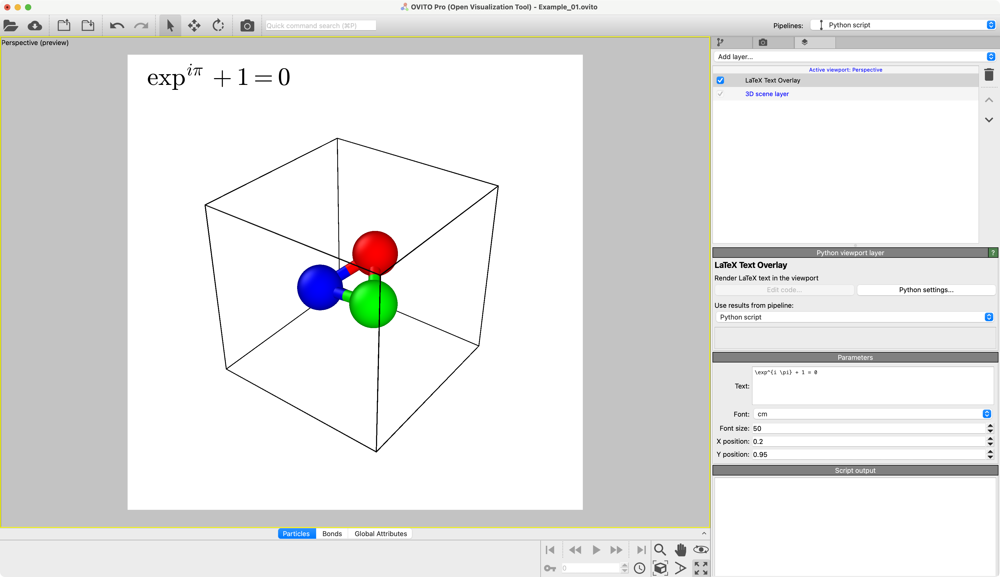

# LaTeX Text Overlay
Render LaTeX text in the viewport

## Description
tbd

## Parameters 
- "Text" | `text`: Text to be rendered in LaTeX. Default = "\exp^{i \pi} + 1 = 0"
- "Font" | `font`: Font of the text. The list of available fonts is platform dependent / matplotlib version dependen. The (alphabetically) first font is used as default.
- "Font size" | `font_size`: Font size of the text. Default = 50.
- "Text color" | `text_color`: Color of the text. Default = (0.0, 0.0, 0.0). (Only available in the GUI starting from OVITO Pro >= 3.10.3).
- "X position" | `px`: X position of the text. Default = 0.5. The position is given in relative coordinates, where 0.0 corresponds to the left edge of the viewport and 1.0 to the right edge.
- "Y position" | `py`: Y position of the text. Default = 0.5. The position is given in relative coordinates, where 0.0 corresponds to the bottom edge of the viewport and 1.0 to the top edge.

## Example


## Installation
- OVITO Pro [integrated Python interpreter](https://docs.ovito.org/python/introduction/installation.html#ovito-pro-integrated-interpreter):
  ```
  ovitos -m pip install --user git+https://github.com/nnn911/LatexTextOverlay.git
  ``` 
  The `--user` option is recommended and [installs the package in the user's site directory](https://pip.pypa.io/en/stable/user_guide/#user-installs).

- Other Python interpreters or Conda environments:
  ```
  pip install git+https://github.com/nnn911/LatexTextOverlay.git
  ```

## Technical information / dependencies
- Tested on OVITO version 3.10.2

## Contact
Daniel Utt utt@ovito.org